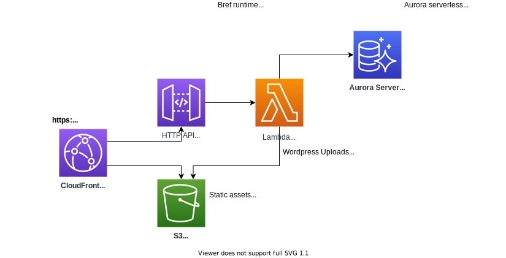

# cdk-serverless-wordpress

This is a proof-of-concept of leveraging [cdk-serverless-php-mpa](https://github.com/aaronbrighton/cdk-serverless-php-mpa) to WordPress serverlessly to AWS using AWS Lambda and some other services including Aurora Serverless. This was made possible in large-part due to the work done by the [Bref](https://bref.sh/) team to make running PHP on AWS Lambda a reality.

## Architecture



## Requirements

- Docker
- Composer

## How to deploy

If you have any trouble following these instructions, please see [CDK Workshop](https://cdkworkshop.com/) for necessary background knowledge.

### Install node dependencies

```
yarn install
```

### Download and configure latest Wordpress

Run the following command to download the latest Wordpress release and automatically configure the wp-config.php.

```
yarn install-wordpress
```

If it was successful, you should see a message like the following printed out:

```
Wordpress config file (src/app/public_html/wp-config.php) has been configured...
```

### Deploy the CDK application

Using CDK provision the new serverless RDS database and associated serverless Wordpress environment.

```
yarn deploy
```

If it was successful, you should see the following output (value may differ for you):

```
Outputs:
cdk-serverless-wordpress.PhpMpaCdnEndpoint = https://d2gwh5zfeeozsl.cloudfront.net/
```

The `PhpMpaCdnEndpoint` is the URL to access your deployed Wordpress instance.

## IMPORTANT: Note on costs

While this is technically a "serverless" deployment, there are some inconvenient realities that come into play when trying to support a traditional/legacy PHP application, therefore please be aware of the following (surprise) costs:

### PrivateLink

The underlying `cdk-serverless-php-mpa` CDK construct will create an AWS PrivateLink connection across 2 subnets for a total of 2 VPC endpoints.  This is necessary from a security stand-point so that if someone were to extract the AWS Lambda IAM role temporary credentials due to a vulnerability in Wordpress (or even just a phpinfo file), they wouldn't be able to use that to access AWS secrets manager secrets.

```
$0.01/hr/VPC interface endpoint
$0.01*2*730
= ~$14.6/mo
```

### Secrets Manager

The RDS database generates a user automatically and publishes that user's credentials to AWS Secrets Manager, where it is then consumed by the Wordpress deployed Lambda function.  Secrets manager has some static costs as well:

```
$0.40/Secret/mo
= $0.40/mo
```

### Total estimated (idle) cost per month

:cry:, I'm open to suggestions on how to reduce costs, ideally without sacrificing *effective* security.

```
~$14.60/mo VPC interface endpoints
$0.40/mo Secrets Manager Secret
= $15
```
